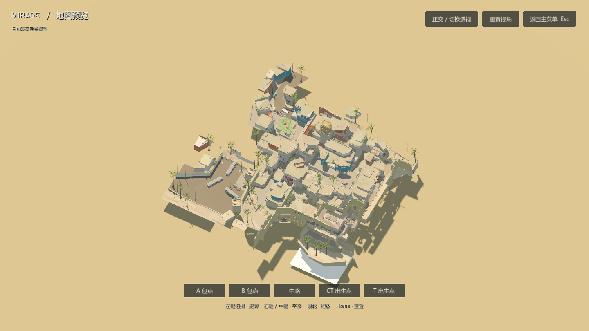

# MIRAGE · CS2.5D

一个 Godot 4.6.3 原生的卡通射击游戏，支持俯视与第一人称切换：在从本机 CS2 原始 Mirage 场景重建的地图中，操作 CT 或 T，与 Bot 进行单人爆破或自由训练。环境保留原场景的物件变换、轮廓和比例，转换为分面顶点色与粗糙材质；角色和武器另行制作卡通模型。当前集中打磨单人体验，多人游戏入口已保留，联机功能尚未实现。

## 启动

直接试玩可下载 [Windows 试玩包](https://github.com/wanheng20031114/CS2.5D/releases/latest)，解压后运行 `Mirage.exe`。

Windows 导出包运行 `builds/Mirage.exe`。`Mirage.exe` 与 `Mirage.pck` 必须保存在同一目录；运行导出包不需要安装 Godot、Python 或 CS2。

从项目目录启动，优先运行已有导出包，没有导出包时运行源码：

```powershell
powershell -ExecutionPolicy Bypass -File .\tools\run_game.ps1
```

直接运行当前源码、打开 Godot 编辑器，或使用 OpenGL 兼容渲染器：

```powershell
powershell -ExecutionPolicy Bypass -File .\tools\run_game.ps1 -Source
powershell -ExecutionPolicy Bypass -File .\tools\run_game.ps1 -Editor
powershell -ExecutionPolicy Bypass -File .\tools\run_game.ps1 -Compatibility
```

源码需要 Godot 4.6.3。脚本会查找 `-GodotPath` 参数、`GODOT_PATH` 环境变量、本机 `C:\Program Files\Godot` 和 PATH 中的 Godot。默认使用 Forward+ 渲染；兼容模式便于在不支持默认图形后端的设备上运行，但环境光与阴影效果可能不同。

## 获取源码

地图 GLB 通过 Git LFS 保存。安装 Git 与 [Git LFS](https://git-lfs.com/) 后克隆完整项目：

```powershell
git lfs install
git clone https://github.com/wanheng20031114/CS2.5D.git
cd CS2.5D
git lfs pull
powershell -ExecutionPolicy Bypass -File .\tools\run_game.ps1 -Source
```

GitHub 页面上的源码 ZIP 可能只包含 LFS 指针，首次启动前请确认已拉取真正的地图模型。仓库已包含游戏运行所需的模型、碰撞、导航和武器资源，无需本机 CS2 或 Python；Godot 会在首次源码启动时导入资源。UI 使用系统中文字体，非 Windows 系统建议安装 Noto Sans CJK SC。



离线重建地图时才需要 Source 2 Viewer 的原始导出和 Python 依赖。源导出目录默认位于系统临时目录下的 `cs25d-map-tools`，也可通过 `CS25D_MAP_SOURCE_DIR` 环境变量指定。运行现成地图不需要重建。

## 玩法

- **爆破对局**：选择 CT 或 T，玩家与 4 名己方 Bot 对抗 5 名敌方 Bot。每回合先有 20 秒购买阶段，随后进行 115 秒的爆破回合；C4 引爆时间为 40 秒。先取得 6 回合胜利的一方获胜。此处采用短局规则，不是完整 CS2 竞技比赛规则。
- **自由练习**：直接进入训练，与 3 名敌方 Bot 交战。开始时有 $16,000、步枪、护甲及基础投掷物，倒地后约 3 秒重生；按 F5 重置训练。出生区可以补给。当前没有独立的可装修家园、仓库存档或战利品撤离流程。
- **购买与背包**：B 打开军械商店，Tab 打开背包。购买只允许在己方出生点附近且购买时间有效时进行；背包与商店打开时，战场仍继续运行，Esc 暂停才会暂停对局。
- **视野**：采用斜俯视跟随镜头。高墙、屋顶、棚布及高处道具会沿玩家朝向的整个视野扇面剖开，也会剖开从镜头方向挡住扇面的前景结构。朝向外及被障碍遮挡的区域变暗，无法看见的敌人隐藏；雷达显示地图、己方位置以及当前可见敌人。可以滚轮调整视野范围。
- **第一人称**：对局中按 V，或在“设置与操作”选择第一人称。鼠标控制水平和上下转向，WASD 按朝向前进、后退和横移，准星固定在画面中心；子弹从眼部沿三维准星方向发射，投掷物随仰角投出。此时关闭俯视剖切与扇面遮罩，显示完整建筑及独立的持枪和手臂模型。右键收紧视野与散布；打开面板、暂停和失焦会释放鼠标。阵亡后回到俯视观察，训练重生及新回合恢复所选视角。
- **地图预览**：主菜单点击“地图预览”，以完整模型观察 Mirage。左键拖动旋转，右键或中键拖动平移，滚轮缩放；支持 A 点、B 点、中路和双方出生点快速定位、正交/透视切换，Home 恢复整图，Esc 返回菜单。预览中关闭视野雾与建筑剖切，不运行战斗。
- **射击**：移动会扩大散布，站定后恢复精度；右键收紧散布并降低移速。连续射击累积扩散，短点射更易控制。AK 的站定首发精度很高；这些射击参数是本项目为俯视玩法设计的数值。

## 操作

| 按键 | 功能 |
| --- | --- |
| W / A / S / D | 俯视时相对屏幕移动；第一人称时前后移动与横移 |
| 鼠标移动 | 俯视瞄准；第一人称水平转向与上下瞄准 |
| V | 切换俯视 / 第一人称 |
| 鼠标左键 | 射击，或挥动匕首 |
| 按住鼠标右键 | 稳定瞄准，同时降低移速 |
| 按住 Shift | 慢步移动 |
| Space | 跳跃 |
| R | 换弹；切换武器会中止换弹 |
| 1 / 2 / 3 | 主武器 / 副武器 / 匕首 |
| 4 / 5 / 6 | 投掷高爆手雷 / 烟雾弹 / 闪光弹 |
| 7 / 8 | 投掷燃烧瓶或燃烧弹 / 诱饵弹 |
| 按住 E | 在有效位置安放或拆除 C4，需保持站定 |
| F / G | 拾取附近武器 / 丢弃当前枪械 |
| B / Tab | 商店 / 背包；再次按下关闭 |
| 滚轮 | 俯视时调整镜头范围，16–34 米 |
| Esc | 关闭面板，或暂停与继续 |
| F5 | 自由训练中重置 |

投掷物按键直接投掷，不需要先装备。最多携带 4 枚投掷物；同类最多 1 枚，闪光弹最多 2 枚。背包内会标出对应快捷键。设置面板可调整音量、俯视镜头范围、开火震动和全屏，也提供 26 项第一人称参数：基础与瞄准视野、鼠标灵敏度与倍率、反转与平滑、俯仰限制、眼高、近远裁剪、持枪视野与三轴偏移、模型缩放、晃动与摆动、镜头后坐及准星。参数可拖动滑条或直接输入数值，支持恢复第一人称默认值；设置保存在 Godot 的用户数据目录。完整默认值、范围和验证方式见 [第一人称说明](docs/first-person.md)。

## 地图、模型与数值

地图来自本机 CS2 的 `de_mirage.vpk`，通过 Source 2 Viewer 只读导出原始世界网格、实体、碰撞和导航地表，按 1 Source 单位 = 0.0254 米统一坐标。A/B 点、T/CT 出生、中路、VIP、拱门、丛林、宫殿、A 坡、B 公寓、下水道、B 小及超市均使用原地图位置与高程。包点合法安放区、16 个 CT 和 17 个 T 出生点也从地图实体读取。

此前由 NAV 推断、人工摆放的场景已被替换。房屋、拱门、箱组、面包车、木窗、地毯、棕榈等环境物件使用原始变换；不透明建筑、地面和道具保留原网格轮廓。离线从原材质采样并量化颜色，去除运行时纹理，按空间分组以降低绘制开销。叶片、网格等透明材质作轮廓简化。普通对局中禁用的 Retake 挡板不激活，Never Solid 实体保留外观但不生成实体碰撞。

建模风格参考 `middle-ages-battle` 的离线合批、分面轮廓和顶点色方法，没有复制其中的模型。角色和枪械为本项目生成；Mirage 环境几何是原版 CS2 资产的转换结果。原生 `.tscn`、`.res`、地图 `.glb` 和生成脚本均在项目中，可继续编辑与重建。高墙采用跟随玩家的俯视剖切，剖切只改变显示，不改变遮挡判定或碰撞。地图外侧增加无碰撞的沙色底景，弥补俯视镜头下原场景天空盒的缺失。

太阳方向和天空配色参考 Mirage 地图实体：暖色太阳 `(255,223,179)`、蓝色环境光 `(130,205,255)`、Source 角度 `(60,318,0)`。Godot 与 Source 2 的曝光、反射和烘焙管线不同，当前没有复制原版光照贴图，因此不能视为原版光照的完全一致复现。

商店武器价格、基础伤害、弹匣、备用弹药和射速，依据 2026-09-13 核对的 CS2 游戏数据镜像；完整表格在 `assets/weapons/catalog.json`。当前包含 45 项武器、投掷物和装备条目，以及对应卡通模型和实际模型渲染图标。手感、后坐扩散、移动惩罚及部分对局规则由本项目独立设计。详细来源见 [地图记录](docs/map-reference.md) 和 [武器记录](docs/weapons.md)。

## 当前边界

场景布局以原始世界和实体为依据，并对几何变换与碰撞进行独立审计，详见 [点位审计](docs/placement-audit.md)。卡通材质、透明表面的轮廓简化、俯视剖切以及 Godot 光照与原版不同；尚未导入 Source 2 的天空盒、烘焙光照及全部动态装饰效果。不能将这些渲染差异称为原版光照的完全一致复现。

Bot 已具备导航、寻找目标、瞄准开火、换弹和基础爆破行动，团队配合与复杂战术仍是初版。角色支持跳跃和台阶，但 Bot 不会进行复杂跳跃路线。完整穿透材质、梯子机制、CS2 全部经济规则、家园与跨局仓库，以及多人同步尚未完整实现。是否达到理想手感仍需实际试玩反馈；后续首先完善单人体验，再开发多人模式。

## 验证记录

当前源码通过 55 项玩法集成检查、32 项真实界面输入检查，以及 22 条使用真实角色和 Jolt 物理的地图通行路线（20 条出生点到包点、A/B 双向回防）。另验证全部 33 个出生点到两包点的 66 条图连接，和高台阶、低顶等 8 项控制器限制。CT、T 两种玩家阵营各运行了 210 秒模拟对局，验证交战、伤害与回合流转。

整扇面剖切另通过 96 项 GPU/物理检查；地图预览经过真实鼠标与键盘输入验证，覆盖旋转、平移、缩放、点位定位、投影切换及退出后开局。本次功能与验证范围见 [视野与地图预览](docs/view-validation.md)。

点位与源网格核对见 [地图审计](docs/placement-audit.md)，实际物理与台阶修复见 [控制器验证](docs/controller-validation.md)，原生界面和渲染采样见 [运行验证](docs/runtime-validation.md)。这些检查不等同于遍历每一条可选战术路线或所有硬件环境。

## 构建 Windows

安装 Godot 4.6.3 及匹配的 Windows x86_64 导出模板后执行：

```powershell
powershell -ExecutionPolicy Bypass -File .\tools\build_windows.ps1
```

输出为 `builds/Mirage.exe`、`builds/Mirage.pck` 和 `builds/README.zh-CN.md`。追加 `-Archive` 可生成 `builds/Mirage-Windows-x64.zip`；追加 `-SkipImport` 可跳过初始资源导入。导出使用项目中的原生模型与地图，不需要重新运行离线建模脚本。

发布包排除测试、构建工具、原始武器数据、生成中间文件和预览截图；保留运行所需的原生模型、图标、场景、脚本、着色器与三份 JSON 数据。源码目录中的详细测量与生成材料仍保留，导出过程不删除它们。

这是非官方的 Mirage 风格重建原型，与 Valve 没有关联。
